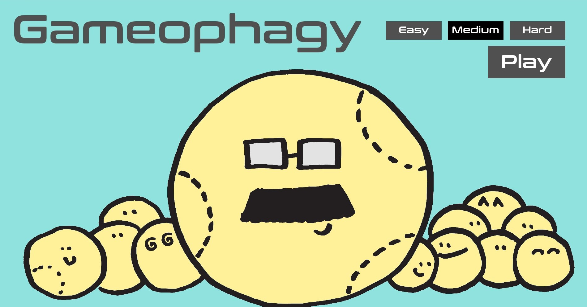
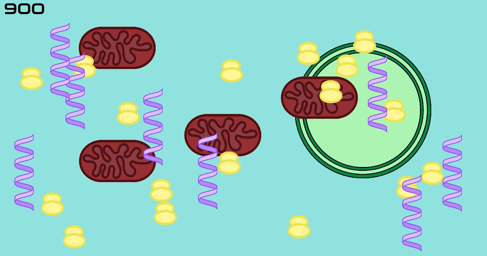
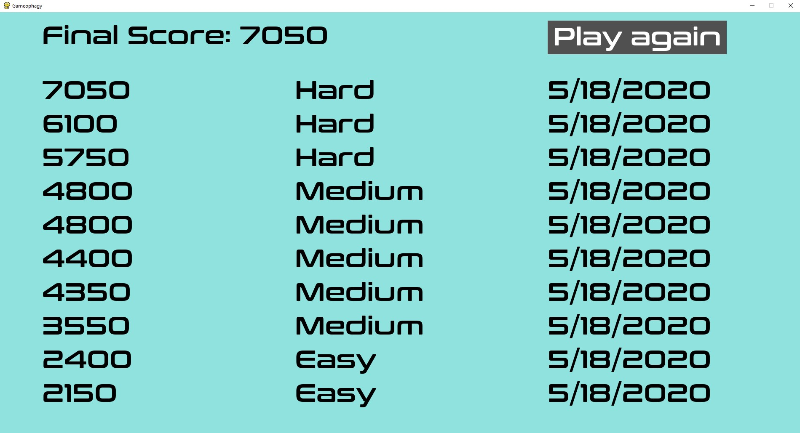

## Overview

It's a game...about autophagy. Try to catch all of the intracellular cargo in the smallest number of autophagosomes. Why are you trying to degrade *everything*? IDK, man; it's a game made by a grad student in a state of severe, pandemic-induced boredom -- don't overthink this.

####  Autophagy

Autophagy is a process carried out inside the cells of everything from humans to yeast (no, those aren't baseballs on the intro page). Things like proteins, RNA molecules and mitochondria are trapped in a bubble-like membrane called an autophagosome and later broken down by enzymes. Prior to the autophagosome bubble closing/completing, it is called a phagophore; this is what you are drawing with your mouse in Gameophagy.

## Getting started

**If you're on Windows**, you can simply download the stand-alone release. Go to Gameophagy releases and download the most recent version, unzip the files launch "Gameophagy.cmd".

Otherwise, clone/download the repository. You will need a recent version of python (3.8 used for development) and the package pygame (1.9.6 used for development). Begin the game by running "main.py".

## Game instructions

Select your difficulty on the introduction page. The harder the difficulty, the less time you have to draw the phagophore, the faster cargo moves but the more points you get per cargo item. After selecting "Play", left click the screen and drag to draw a phagophore; your mouse must end within the large circle marking the starting location. And be fast -- there's a time limit for drawing.  Upon phagophore closure, hold left-click on the autophagosome, drag, and then release to send it to the vacuole for degradation. If you run out of time while drawing a phagophore, an autophagy inhibitor pill spawns. Avoid capturing these as they will lower your score.

**Introduction page illustration credit: Javiera Balut**

