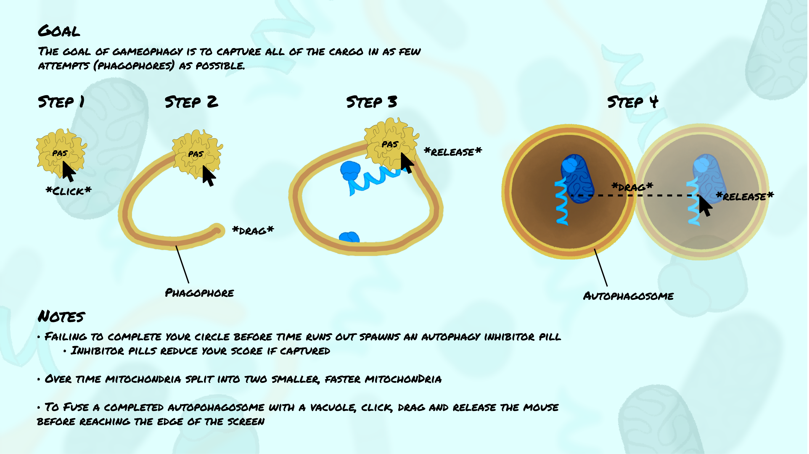
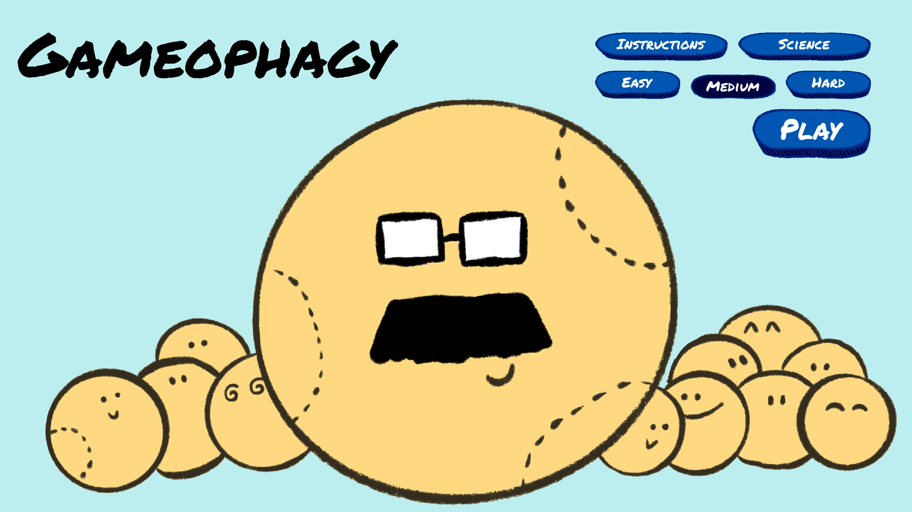
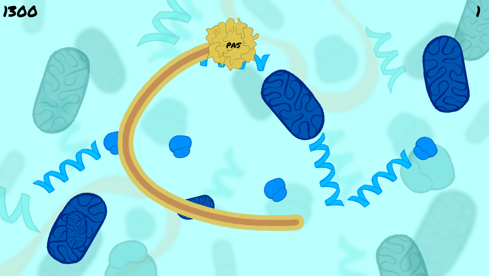
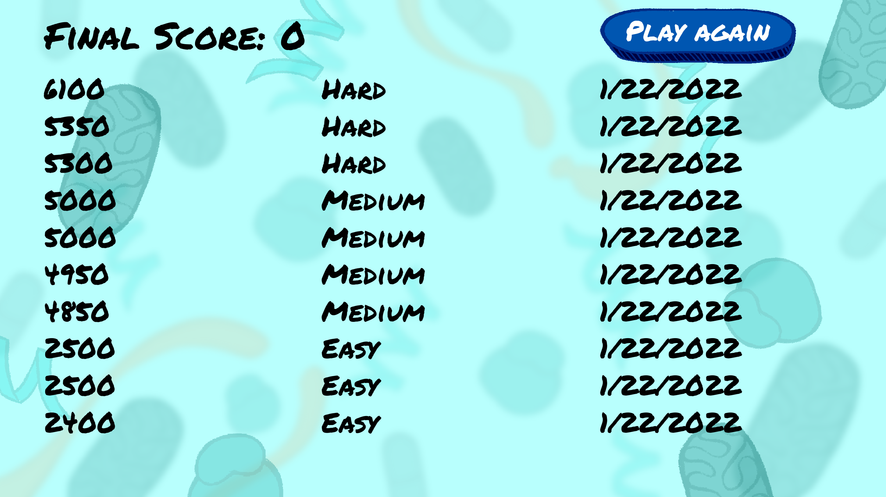

## Overview

It's a game...about autophagy. How has no one thought of this before? Try to catch all of the intracellular cargo in the smallest number of autophagosomes.

Huge shout out to Javiera Balut for creating the art for the introduction page and to Emily Grush for creating all other illustrations in the game.

##  Autophagy

Autophagy is a process carried out inside the cells of everything from humans to yeast (no, those aren't baseballs on the intro page). Things like proteins, RNA molecules and mitochondria are trapped in a bubble-like membrane called an autophagosome and later broken down by enzymes. Prior to the autophagosome closing/completing, it is called a phagophore; this is what you are drawing with your mouse in Gameophagy. See the game's "Science" section for more details about autophagy and cell biology more broadly.

## Getting started

Go to Gameophagy releases and download the most recent version for your operating system. Unzip the folder and launch the "Gameophagy" file.

**On Windows**, you may be prompted with a security verification. Click "More info" then "Run anyway".

**On Mac**, you may receive an error message. Navigate to the "Security and Privacy" tab within System Preferences. Click the Padlock and within "General", select "Open Anyway". For some devices, this still doesn't work, in which case the only option is to run the game from the source code. Download the "Uncompiled" version of Gameophagy from the appropriate release. You will need a recent version of python (3.7 used for development) and the package pygame (1.9.6 used for development). Begin the game by running "main.py".

## Game instructions

